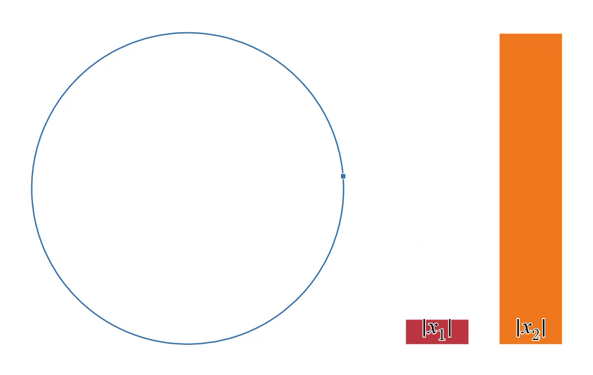
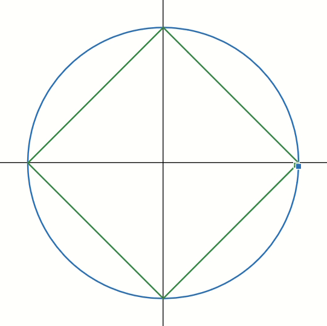

# L1 Cyclical Encoding: A Constant-|Derivative| Alternative to Standard Trigonometric Embeddings

Traditional cyclical feature engineering maps periodic inputs (such as time of day, day of the week, or wind direction) to a unit circle using standard trigonometric functions:

$$
x_1 = \cos\left(2\pi t \right), \quad x_2 = \sin\left(2\pi t \right)
$$

While this preserves continuity across the boundary ($t=0 \equiv t=1$), it introduces a major artifact: **the rate of change of the derived features is not constant** w.r.t. input feature.

Because the derivatives are themselves sinusoidal, the speed at which coordinates change varies across the domain, accelerating near the axes and decelerating near the diagonals. This often degrades the performance of linear systems and optimization surfaces, such as those in Neural Networks.

This repository introduces **L1 Cyclical Encoding**, an alternative approach that maps periodic variables along a Manhattan-distance ($L_1$ norm) boundary:

$$
|x_1| + |x_2| = 1
$$

By executing a steady counter-clockwise walk around this diamond-shaped perimeter instead of an $L_2$ circle, **the rate of change remains perfectly constant and identical to the initial variable**. Furthermore, it completely eliminates the need for expensive floating-point trigonometric expansions (`sin` and `cos`), relying purely on simple arithmetic and modulo operations.

## Mathematical Framework & Geometry

### Standard Encoding ($L_2$ Circle)
When moving at a constant speed along a circle, the absolute value rate of change for each individual feature w.r.t the input variable continually fluctuates:

$$
\exists \, i \in \{1, 2\} \quad \text{and} \quad \exists \, t_1, t_2 \quad : \quad \left| \frac{dx_i}{dt}(t_1) \right| \neq \left| \frac{dx_i}{dt}(t_2) \right|
$$

### Linear Encoding ($L_1$ Diamond)
This fluctuation is remedied here, making it highly suitable for linear processing and gradient-based models like Neural Networks or Linear Regression. Within any given quadrant of the perimeter, the individual feature rates of change are perfectly uniform:

$$
\forall \, i \in \{1, 2\} \quad \text{and} \quad \forall \, t_1, t_2 \in \text{Quadrant}_k \quad : \quad \left| \frac{dx_i}{dt}(t_1) \right| = \left| \frac{dx_i}{dt}(t_2) \right|
$$

\* The derivative is technically undefined at the sharp corner vertices (points of non-differentiability), but this has no practical implication for feature engineering or downstream machine learning tasks.

## Implementation

A [Python implementation](./l1_cyclic.py) & it's [documentation](./DOCUMENTATION.md) is provided with the repository.